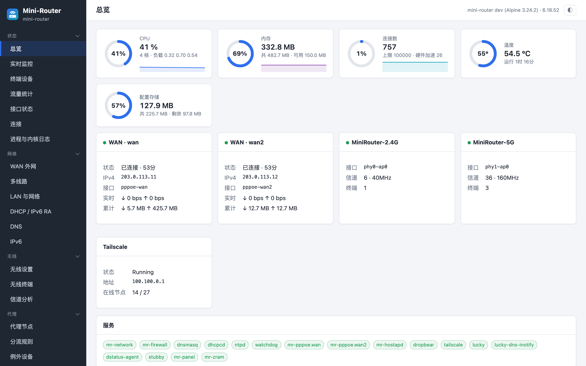
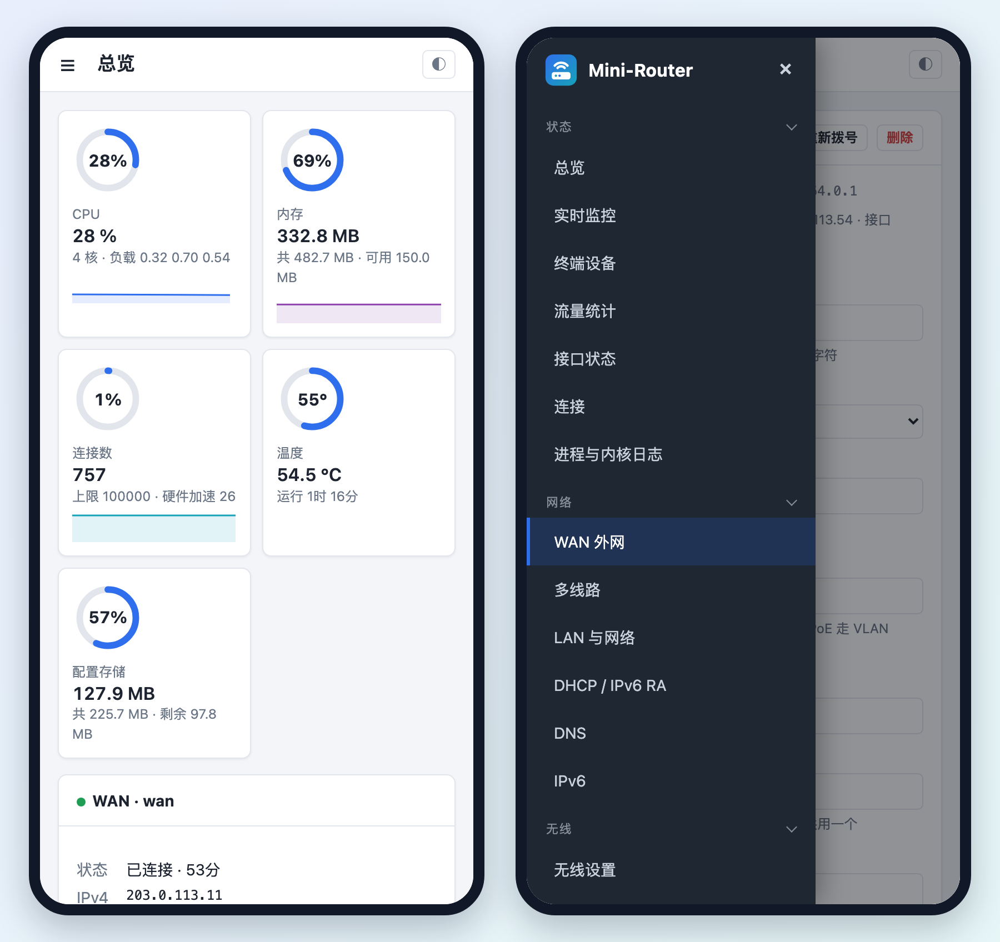
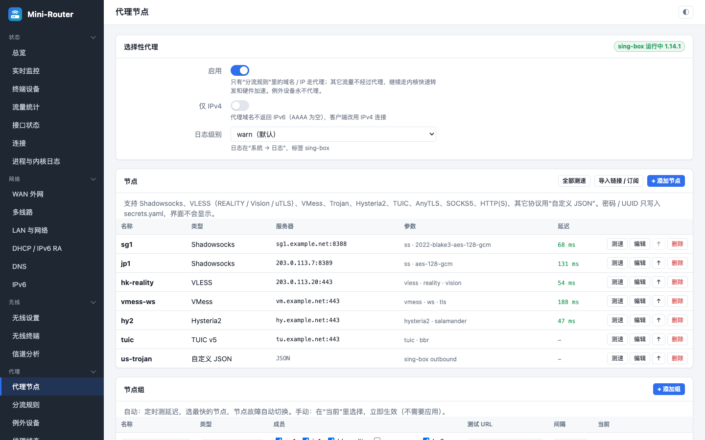
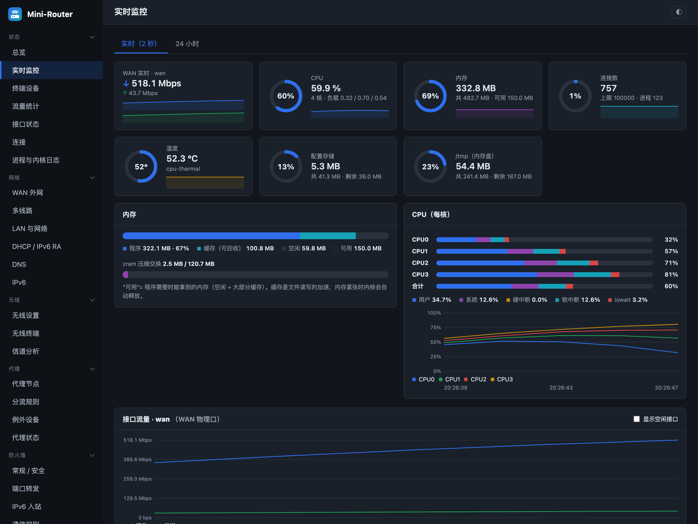

<p align="center">
  <picture>
    <source media="(prefers-color-scheme: dark)" srcset="docs/assets/logo-dark.svg">
    
  </picture>
</p>

<p align="center">
  <b>一个 YAML、一个程序、一个专业的网页界面——基于 Alpine Linux 的极简路由器系统</b><br>
  A minimal, declarative router OS on Alpine Linux: one YAML file, one static binary, a professional web UI.
</p>

<p align="center">
  <a href="https://github.com/Cd1s/mini-router/actions/workflows/ci.yml"></a>
  <a href="https://github.com/Cd1s/mini-router/releases/latest"></a>
  
  <a href="LICENSE"></a>
</p>

<p align="center">
  <a href="#安装--install">安装</a> ·
  <a href="#功能--features">功能</a> ·
  <a href="#工作方式--how-it-works">工作方式</a> ·
  <a href="#使用--usage">使用</a> ·
  <a href="#ai-agent-管理">AI agent</a> ·
  <a href="#开发--development">开发</a> ·
  <a href="https://github.com/Cd1s/mini-router/releases/latest">下载</a>
</p>

<p align="center"></p>

Mini-Router 面向**家庭 / 家庭服务器的主路由**：安全优先、性能优先（硬件加速对普通流量始终生效）、不堆没用的功能。
整台路由器由一个 `router.yaml` 描述；`mr`（约 5 MB 的静态 Go 程序，不常驻）负责校验、生成全部配置文件、
应用并自检，出问题**自动回滚**。网页界面、命令行和 AI agent 用的是同一套机制。

The whole router is one `router.yaml`. `mr` validates it, renders every config file, applies with a snapshot,
checks every service and rolls back on its own. The web UI, the CLI and AI agents all go through the same path.

## 亮点 / Highlights

- **声明式，改错了能回来**：校验 → 显示变更计划 → 快照 → 应用 → 自检；`--confirm` 倒计时内不确认就自动回滚，
  改断了网也能自己恢复。每次变更有历史，可回到任意快照。
- **快**：flowtable 硬件卸载（MT7986 PPE + WED WiFi 转发）、BBR；只有命中分流规则的流量才进代理，
  其余流量照常走硬件加速。
- **小**：Alpine 基础系统 + 必要组件；`mr` 不常驻，没有空转的守护进程。AX6000 镜像为只读 squashfs + UBIFS 配置分区。
- **选择性透明代理**：sing-box、fake-ip DNS、nftables tproxy；SS / VLESS (REALITY) / VMess / Trojan / Hysteria2 / TUIC /
  AnyTLS / SOCKS / HTTP，分享链接与订阅一键导入，按设备例外。
- **专业的网页界面**：接近 LuCI / RouterOS 的覆盖面，手机可用，浅色 / 深色主题，改动集中“保存并应用”。
- **任意架构**：一条命令装到任何 Alpine（x86 小主机、虚拟机、树莓派、ARM 板）；Redmi AX6000 有完整固件镜像。
- **为 AI agent 设计**：配置即代码、命令输出 JSON、自带 agent skill（[`skills/mini-router`](skills/mini-router/SKILL.md)）。

## 截图 / Screenshots

| 手机端（抽屉菜单） | 选择性代理 |
|---|---|
|  |  |

<p align="center"><br>
<sub>实时监控：CPU / 内存 / 存储占用、每核 CPU 构成、接口流量（深色主题）。截图均为演示数据。</sub></p>

## 功能 / Features

| 模块 | 内容 |
|---|---|
| 网络 net | LAN 网桥、访客 / IoT 网络、VLAN；WAN：PPPoE / DHCP / 静态，多拨，**多线故障切换 / 负载均衡**；策略路由（按设备 / 源 / 目的走指定线路）、静态路由、组播（IGMP snooping / proxy）；双线 IPv6（PD + 源地址路由） |
| 无线 wifi | 多 SSID、访客 SSID、客户端隔离、MAC 黑白名单、WPA2/WPA3、终端列表与踢人、信道分析；AX6000 调优档 + 任意网卡的通用档 |
| DNS / DHCP | dnsmasq：DHCP 静态分配与选项、IPv6 RA / DHCPv6、本地记录（A/AAAA/CNAME/SRV…）、DNS 分流、DoT（stubby）、统计与临时查询日志 |
| 防火墙 fw | nftables：区域、端口转发（来源限制 / 线路选择 / NAT 回流）、IPv6 入站（按接口标识，前缀变化也有效）、通信规则（含时间段）、设备上网管控、硬件 / 软件流量卸载 |
| 代理 proxy | sing-box 选择性透明代理：fake-ip + nftables tproxy，只有命中规则的域名 / IP 进代理；全协议节点、节点组（自动测速 / 手选）、分享链接与订阅、例外设备 |
| 监控 mon | 占用仪表（CPU / 内存 / 连接数 / 温度 / 存储）、每核 CPU 构成、内存构成、实时流量图、24 小时历史、每设备流量、连接表、进程与内核日志 |
| 系统 sys | 时区 / NTP、SSH 与密钥、计划任务、备份恢复、固件升级、服务管理、日志、诊断（ping / traceroute / nslookup） |

刻意**不做**的：WireGuard 服务端、SQM、UPnP、广告过滤这类“有了更像 OpenWrt”的功能——每个功能都要对得起它占的内存和闪存。

## 工作方式 / How it works

```
            网页界面 / CLI / AI agent
                       │  修改
                       ▼
   /etc/mini-router/router.yaml  +  secrets.yaml (0600, 只存密码 / 密钥)
                       │
   mr validate ──► mr plan ──► mr apply ─┬─ 快照（mr history / mr rollback）
   （每个字段校验）   （变更计划）          ├─ 生成：nftables · dnsmasq · hostapd · pppd · dhcpcd
                                         │         sing-box · sysctl · OpenRC 运行级别
                                         ├─ 按依赖顺序重启受影响的服务
                                         └─ 自检全部服务 ── 失败 ──► 自动回滚
                                                  │
                                         --confirm N 秒内 mr confirm，否则回滚
```

功能按模块组织（net / wifi / dns / fw / mon / proxy / sys），每个模块通过固定的钩子接入校验、渲染、防火墙、
服务管理和网页 API，约定见 [docs/MODULES.md](docs/MODULES.md)。

## 安装 / Install

### 1. 任意架构的 Alpine Linux

适合 x86 小主机、虚拟机、树莓派、各种 ARM 板。先装好 Alpine（至少两个网口，或一个网口 + 无线网卡），然后：

```sh
wget -O install.sh https://github.com/Cd1s/mini-router/releases/latest/download/install.sh
sh install.sh
```

脚本会问：WAN 网口与类型（DHCP / PPPoE / 静态）、LAN 网口、路由器 IP、WiFi 名称和密码、网页管理员密码、时区，
然后安装软件包、下载对应架构的 `mr`、生成配置并应用。完成后打开 `http://路由器IP/`。

无人值守（所有问题用环境变量回答，其它变量见 `install.sh` 开头；`MR_APPLY=0` 只安装不应用）：

```sh
MR_YES=1 MR_WAN=eth0 MR_WAN_PROTO=pppoe MR_PPPOE_USER=xxx MR_PPPOE_PASS=xxx \
MR_LAN_PORTS="eth1 eth2" MR_LAN_IP=192.168.1.1/24 MR_ADMIN_PASS=change-me-123 sh install.sh
```

### 2. 固件镜像：Redmi AX6000

OpenWrt 6.18 内核 + 开源 mt76 + WED/PPE 硬件加速，squashfs 系统 + UBIFS 配置分区（hanwckf 110M U-Boot 布局）。
先用 kexec 在内存里试运行，再写入闪存，全程可回滚到原系统：[docs/flash.md](docs/flash.md)。
之后的升级在网页“系统 → 备份与升级”或命令行完成，设置保留；失败时自动回到旧系统。
其它路由器型号需要各自的内核与设备树，欢迎贡献（[docs/modules/platform.md](docs/modules/platform.md)）。

### 3. 从源码构建

```sh
./tools/release.sh v0.2.0 out/release   # 需要 Go；产出 7 个架构的 mr + 系统文件包 + install.sh
MR_LOCAL=out/release sh install.sh      # 在目标机器上离线安装
```

## 使用 / Usage

```sh
vi /etc/mini-router/router.yaml   # 或者在网页里改
mr plan                           # 看会改什么
mr apply --confirm 120            # 应用；120 秒内不执行 mr confirm 就自动回滚
mr confirm
mr status | mr history | mr rollback [快照]
mr wan status · mr wifi stations · mr dns leases · mr proxy status · mr mon devices   # JSON
mr passwd < 密码文件               # 重设网页管理员密码
```

各模块的配置项和“怎么用”：[docs/modules/](docs/modules/)。示例配置：[examples/](examples/)。

## AI agent 管理

[`skills/mini-router/SKILL.md`](skills/mini-router/SKILL.md) 是给 AI agent（Claude Code、Codex 等）用的操作手册：
安全改动流程（读 → 校验 → plan → `apply --confirm` → 回读验证 → confirm）、`router.yaml` 速查、常见任务、
诊断命令和禁止事项。放进 agent 的 skills 目录即可：

```sh
mkdir -p ~/.claude/skills && cp -r skills/mini-router ~/.claude/skills/
```

## 安全 / Security

- 网页和 SSH 只在内网监听；公网入站默认全部拒绝，端口转发 / 开放端口逐条声明。
- 所有写进配置文件的字符串都经过校验（这是安全边界），修改类 API 只接受 POST，任何接口都不返回密码。
- 密码、密钥、订阅链接只存在 `secrets.yaml`（0600），`router.yaml` 里只写引用名。
- 网页管理员密码加盐哈希存储；首次设置只能在内网完成。

## 开发 / Development

- 架构与模块约定：[docs/MODULES.md](docs/MODULES.md)。每个功能 = 一组 Go 文件 + 一个网页文件 + 文档 + CI 片段。
- 检查：`sudo ./tools/ci.sh`（Linux）——gofmt、vet、单元测试、交叉编译、shellcheck；示例配置和“全功能”实验配置
  渲染后交给真实的 `nft` / `dnsmasq` / `hostapd` / `sing-box` 校验，并在网络命名空间里跑防火墙、多线、代理的端到端测试。
  GitHub Actions 每次推送自动运行。
- 网页界面本地调试（无需路由器）：`python3 tools/mock/mockapi.py 8088` → http://127.0.0.1:8088/
- AX6000 固件：`build/m3/`（内核、镜像、nandsim 自测：升级 / 回滚 / 首次启动全流程）。

## 状态 / Status

在 Redmi AX6000 上作为家庭主路由长期运行：双 PPPoE、双线 IPv6、硬件加速、WiFi 6 160 MHz、选择性代理，
从闪存原地升级已验证。其它硬件通过 `install.sh` 支持，欢迎反馈与 PR。

## License

[MIT](LICENSE)。AX6000 镜像包含 sing-box（GPL-3.0）、Linux 内核（GPL-2.0）等上游组件，各自遵循其许可证。
